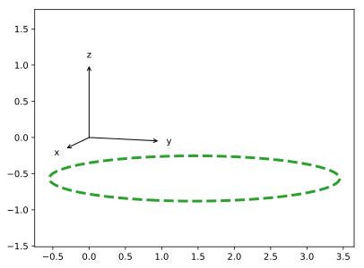
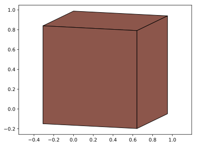
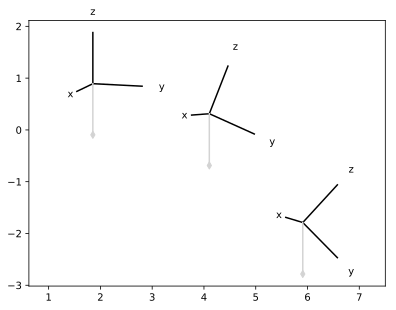

# Pycavalier

Pycavalier is a Python library to draw 3D objects using an oblique projection with Matplotlib.

The orientation of the projection is with respect to the observer, and the vertical direction is kept track of.

## Quick example

```python
from pycavalier import projection_tools as pt
from pylab import *

# create a view point

viewpoint = pt.viewpoint( latitude = 0.9*pi/2., longitude = pi/10. )

# show refrence frame

viewpoint.show_reference_frame()

# create disk

radius = 2
theta = linspace(0,2*pi,100)
center = array( [ 3, 2.5, 0 ] )
circle = center + array( [ radius*cos(theta), radius*sin(theta), 0.*theta ] ).T

# show disk

viewpoint.plot_points( circle, '--', lw = 3 )

axis('equal')
show()
```


## Patches
```python
from pycavalier import projection_tools as pt
from pylab import *

# create a view point

viewpoint = pt.viewpoint( latitude = 0.9*pi/2., longitude = pi/10. )

# create box

sides = [ [ [0,0,1], [0,1,1], [1,1,1], [1,0,1] ] ]
sides += [ [ [1,0,0], [1,0,1], [1,1,1], [1,1,0] ] ]
sides += [ [ [0,1,0], [0,1,1], [1,1,1], [1,1,0] ] ]

# show box

for side in sides :
    viewpoint.plot_patch( side, color = 'tab:brown', edgecolor = 'black' )

axis('equal')

show()
```


## Tilt the reference frame

```Python
from pycavalier import projection_tools as pt
from pylab import *

# define the vertical direction

tilt_angles = [ 0, -pi/8, -pi/4 ]

for tilt_angle in tilt_angles :

    # create viewpoint with tilt

    viewpoint = pt.viewpoint( latitude = 0.9*pi/2., longitude = pi/10., plummet = [ 0,-sin(tilt_angle), -cos(tilt_angle) ] )

    # translate reference frame

    viewpoint.reference_frame['center'] = viewpoint.reference_frame['center'] + array( [-6, 0, 0] )

    # show refrence frame and plummet

    viewpoint.show_reference_frame()
    viewpoint.show_plummet()


axis('equal')
show()
```

